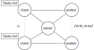

# Elastic Mathematics Server

Your task in this assignment is to implement a server that is able to perform some mathematical binary operations (concretely: addition, subtraction and multiplication).
The server must have the following features:

1. *Parallelism* - The server must be able to process many operations in parallel.
2. *Elasticity* - The server must be able to reduce/increase the amount of resources that it uses to compute the operations depending on how many operations are requested.

The operations are submitted by clients that you must implement as well. A client has a list of tasks that submits to the server and wait for the answer.

## Architecture

Your task is to implement the server described above using the Actors model.
More precisely, **you must use the [Akka library for Java](https://akka.io)** to implement the system.

The figure below depicts a high level overview of the architecture of your application.

<br>

<div style="text-align:center"></div>

<br>

In the figure, circles represent the different actors in the system (clients, server and workers), arrows model the allowed flows of communication.
The system is composed by *n* clients that have a lists of tasks (mathematical operations) to be computed by the server.
For each task, the clients submit a a request to the server.
The server keeps track of a list of workers which perform the tasks requested by the clients.
When the server receives a task it checks whether there is an available worker, and, if so, it assigns the task to the worker.
Otherwise, the server marks the task as pending so that it can be performed in the future by an available worker.
The amount of workers depends on the workload in the server.
The server has a *min* and *max* number of workers that can be created.
The system will always have at least *min* workers and at most *max* workers.
When a task is submitted, if there are no workers available, but the amount of active workers (workers computing some operation) have not reached *max*, then the server is allowed to create a new worker.
The server is also parametrised by a variable *tick* indicating an amount of time in seconds.
Every *tick* seconds, the server must check whether there are idle workers (i.e., workers not computing any operation), if there are more than *min*, then a worker must be terminated.
This processes can be repeated until there are *min* workers in the system.

### Source code overview

In order to better understand the requirements it is advisable to fully understand the code skeleton provided.
So please spend some time going through the code.
Here we provide a simple explanation of each file:

* `Task.java` - This class are use to define task to be computed. Additionally, the `enum` `BinaryOperation` is defined. This `enum` is used to specify the available operations that can be computed, i.e., `SUM`, `SUB` and `MUL`.

* `ClientTask.java` - This class extends `Task`, with the result of the task and flag indicating whether the task is done.

* `Client.java` - It is the actor class for clients. It contains a list of `ClientTask` which represents the tasks that the client will ask the server to compute.

* `Server.java` - It is the actor class for th server. It contains three integer variables, `max` (maximum number of workers), `min` (minimum number of workers) and `tick` (time in seconds to check the amount of idle workers).

* `Worker.java` - It is the actor class for workers. It contains the implementation of the binary operations in `BinaryOperation`.


* `Main.java` - Entry point of the program. It simply creates a client (together with its list of tasks) and a server and sends to the client a `ClientStart` message, which is used to indicate the client to start processing its tasks.


## Requirements

### Client

Clients are modelled as Akka actors. They have a list of `ClientTask`. A `ClientTask` is an object that contains a `BinaryOperation` (which is an `enum` with the values `SUM`, `SUB` or `MUL` defined withing the `Task.java` class), two parameters `x` and `y`, the `result` of the binary operation, and a boolean flag `done` which indicates whether the task has been done.


* For each request to the server, clients can send at most one task from their list of tasks. In other words, it is not allowed to send the whole list of tasks to the server in one message. For instance, if the list of tasks is composed by 3 tasks, three different messages must be sent to the server.

* There are no assumptions about the `id` of the tasks lists. For instance, two tasks from different clients may have the same `id`.

* Clients cannot receive messages from the server.

* There can be an unbounded number of clients in the system.

* The results of the submitted tasks must stored in the same list as when they are initialised (variable `private List<ClientTask> tasks` in `Client.java`) and **in the same order as when they were requested**. For instance, if the list of tasks is `[1+2,3-2]` the list of tasks after processing must be `[3,1]`. If after submitting the tasks, the resulting list is, e.g., `[1,3]`, the result is considered as incorrect.
Note that, in this example, we are using a simplification of `ClientTask` objects as they should include `id`, the flag `done` and so on.

### Server

The server is also modelled as an Akka actor.
The minimum elements of the server state are: the minimum `min` and maximum `max` number of workers, and a recurrence `tick` (expressed in seconds) which determines how often the server must check that the amount of workers is correct.

* The server may receive messages from clients but cannot send messages to clients.

* The amount of workers depends on the submitted tasks. At any point in time there can be at most `max` workers and at least `min` workers. When a task is submitted, if there are no available workers and the number of active workers is equal to `max` a new worker may be created. Also, every `tick` seconds, the amount of idle workers must be revised, if the number of idle workers is greater than `min`, then a worker must be terminated.

* If a task request is received, the amount of active workers is equal to `max`, and none of the workers can currently work on the task, then the task must be set as pending.
When a worker finishes processing a task, the server must make sure that, if there are pending task, the worker will immediately work in one of them.

* The server cannot be blocked at any moment. It must always be able to receive requests.

### Worker

Workers are modelled as an Akka actors.
The skeleton of this class contains the implementation of the operations `SUM`, `SUB` and `MUL`. The implementation of these operations cannot be modified.


* Workers may receive messages from the server, but cannot send messages to the server. Moreover, workers can send messages to clients.

## Running the code

In order to run the code we use the Java project management tool [Apache Maven](https://maven.apache.org/).
A `pom.xml` file including all required dependencies and plugins is already provided. Therefore, it is not necessary to update this file.
Note that the commands below are for Unix based systems.
The following commands must be executed under the directory `akka-elastic-math-server/`.

In order to compile and execute you can run:
```bash
$ mvn compile exec:exec
```


If you would like to simply compile the code, you can run:
```bash
$ mvn compiler:compile
```

### Correctness unit test

We provide a very simple unit test that, after a client has requested all the tasks in `List<ClientTask> tasks`, it waits for all `done` flags to become `true` and checks that the position of the tasks in the list have not changed and the results of each task are correct.

In order to run the test you may use the following command:
```bash
$ mvn test -Dtest=ElasticServerTests
```

### Makefile

There is also a Makefile in the repository which you can use to: compile and run (`make run`), only compile (`make compile`), and run the unit test (`make test_elastic_server`).
